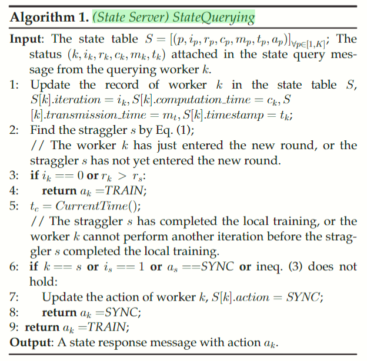

<!-- _class: lead gaia -->

# Federated Learning Presentation

**Paper:** ESync: Accelerating Intra-Domain Federated Learning in Heterogeneous Data Centers

**Publisher Info:** TSC20, Journal Impact 5.69

**Reporter:** Lee Sen.J

**Date:** 17th / October / 2024

---

<!-- header: Outline -->

## Outline

1. Background & Related Works
2. Architecture Design
3. Modeling & Algorithm
4. Convergence Analysis
5. Experimental Evaluation
6. Appreciation

---

<!--header: Background-->

## Background

### Today's Federated Learning

- McMahan *et al*. proposed FL to realize privacy-preserving collaborative learning.
- Cross-device FL & Cross-Silo FL
    - Focus on scenarios where clients and parties communicate ML models with the central server over bandwidth-limited **inter-domain** networks (cross WAN),
    - Isolated parties (scale at hundreds or thousands),
    - Uneven and non-i.i.d data distribution.
- Novel scenarios: **intra-domain FL** in heterogeneous data centers
    - Sufficient bandwidth,
    - Highly heterogeneous computing power.
        - ***We need to make improvements!***

---

<!--header: Related Works-->

### Existing Literatures' Methods

- **Sync**hronous methods:
    - **FedAvg**: poor convergence rate(1400:36), straggler problem, non-i.i.d problem.
    - **FedDrop**: time window,
    - **TiFL**: grouped into multi-tiers, straggler less possible to contribute,
    - **SSGD**: (traditional DML) free of communication bottleneck, but bottlenecked by strong computational heterogeneity, has the same convergence rate on non-i.i.d. data as on i.i.d. data

- **Async**hronous methods:
    - **ASGD**: natural adaptable to computaional heterogeneity, but poor accuracy,
    - **FedAsync**: update the global model immediately by weighted averaging, introduces a mixing hyperparameter to mitigate the error caused by staleness.
    - **DC-ASGD**: compensate stale gradients using Talor expansion.

---

<!--header: Goals-->

### Goals of the Work

To address the stragglers in the strongly heterogeneous *intra-domain FL*, while maintaining accuracy without loss, adaptively avoid blocking caused by stragglers.

- A novel **scheduler**.
- An efficient **synchronization algorithm** (based on SSGD).
- Analyze the **trade-off** between convergence accuracy and communication efficiency.
- Extensive experimental evaluation on real-world datasets.

---

<!--header: Architecture-->

## Architecture Design

### Overview

- **State Server**: monitor the status and progress, coordinate the synchronization pace of all workers.
- **Parameter Server**: average the updates and synchronize the averaged updates to all workers.
- **Workers**: perform local updates and send their updates to the parameter server.
    - up to State Server's instruction.

---

### State Server

State Server contains
- a **message receiver**, a **message sender**,
- a FIFO **message queue**,
    - buffer the received messages.
- a **message router**,
    - forward to the handlers accoring to `msg_type` field.
- a **state database**,
    - lock-free state table.
- and a set of **message handlers**.

---

### Message Format & Message Types

- **state reset message**: initiated by the Parameter Server, to initialize the records in the state database.
- **～report msg**: initiated by the worker to synchronize its status and progress to State Server.
- **～query msg**: initiated by the worker to query State Server for the next action.
- **～response msg**: used by State Server to inform the querying worker of the next action.

---

### State Database

State database contains
- a **task queue**,
    - buffer the received tasks from handlers.
- a **task engine**,
    - multi-threaded asynchronous task processor,
    - process the tasks in the queue according to state table.
- a **state table**,
    - record the status and next action of all workers.

---

#### How to find stragglers and determine the number of local iteration?

Suppose the rank of straggler is $s=1$ , and define delay $d_{k}=c_{k}+m_{k}$ . To decide the next action for the querying worker $k$ , the task engine uses the status $(k,i_{k},r_{k},c_{k},m_{k},t_{k})$ attached to the msg to update the state table, traverse it to find the straggler:
$$
s=\underset{k}{\arg\max}\ d_{k},\quad(k\in[1,K]),\tag{1}
$$
return the status $(s,i_{s},r_{s},c_{s},m_{s},t_{s})$ to the query handler, it will predict the moment $\hat{t}_{s}$ when the straggler $s$ submits its update:      $\hat{t}_{s}=t_{s}+d_{s},\tag{2}$
Then, checks whether the querying worker $k$ can perform another iteration before $\hat{t}_{s}$:
$$
t_{c}+d_{k}\le\hat{t}_{s},\text{ where }t_{c}\text{ is the current timestamp.}\tag{3}
$$

---

<!--header: Algorithm -->

## Modeling and Algorithm

### Problem Modeling

The goal of this paper is to minimize (a) **the global loss** and (b) **the blocking time**.

#### Minimize the global loss

Define a function $f$ that maps input $x$ to a probability vector $\tilde{y}$ using weights $w$ and a classification $c$ probability $f_c$ using cross-entropy loss $l$ as the loss function:
$$
l(w,x,y)=\sum\limits_{c=1}^{C}p(y=c)[\log f_{c}(x,w)].\tag{4}
$$
$l(w,x,y)$ can be extend to local loss $l_k(w_k,x_k,y_k)$ of worker $k$, and global loss $l_g(w,x,y)$.

---

Therefore, the first goal (a) is to minimize the global loss $l_g(w,x,y)$, and find the optimal weights $w^{*}$:
$$
w^{*}=\underset{w}{\arg\min}\ l_{g}(w,\mathcal{X},\mathcal{Y})\tag{7}
$$

#### Minimize the blocking time

For party $k$ , the delay $d_{k}$ is the sum of its computation and transmission time $d_k=c_k+m_k$. Define the computational heterogeneity as $h_c=\frac{c_{max}}{c_{min}}$ and the communication heterogeneity as $h_m=\frac{m_{max}}{m_{min}}$ . Then, the blocking time of the party $k$ can be defined as:
$$
d_{k}^{\text{wait}}=c_{s}+q_{s}+m_{s}-i_{k}(c_{k}+q_{k})-m_{k},\tag{8}
$$

Since the data center network has a strong computational heterogeneity ($h_{c}\le300$), weak communication heterogeneity ($h_{m}\approx1$), and sufficient bandwidth, we simplify (8) by $q_{s}=q_{k}\approx0$ and $m_{s}=m_{k}$.

---

Fig. 7 shows the timeline of the proposed algorithm `ESync`. The core idea is to make use of the blocking time to train more iterations.

Therefore, the second goal (b) is to find a strategy $\pi$ to coordinate the number of local iterations $i_k(\pi)$ for each worker to minimize the overall blocking time $d^{\text{wait}}$:
$$
\underset{\pi}{\text{minimize}}\quad d^{\text{wait}}=\sum_{k\in[1,K],k\ne s}(c_{s}-i_{k}(\pi)c_{k}).\tag{9}
$$

---

### Algorithm Design

As shown in Fig 6(a), SSGD forces all workers to synchronize their local models in each iteration, and the powerful workers are blocked until the straggler uploads its update.

ESync allows the powerful workers to train as many iterations as possible without waiting for the straggler, where the number of local iterations $i_k$ is adaptively coordinated by State Server.

---

Fig 6(b) shows a round $r(r\rightarrow0)$ in the early training, where the powerful party $B$ explores a local weight $w_{B}^{r,4}$ that is closer to the global optimum $w^{*}$ after multiple local iterations, and pushes the local weight $w_{A}^{r,1}$ of the straggler party $A$ closer to the global optimum $w^{*}$ , thus speeding up convergence and avoiding blocking.

Meanwhile, ESync will not fall into the local optimum of the powerful party in the later training ($r\rightarrow R$), as shown in Fig 6(c ), the local model $w_{B}^{r,3}$ of the powerful party $B$ has reached its local optimal $w_{B}^{*}$ after several rounds of iterations, but the straggler party $A$ is still slowly pushing the global model $w^{r+1}$ leaves the local optimum of $B$ (because the $|w^{r}-w_{A}^{*}|$ gap is too large and clearly erroneous), and eventually the global model $w^{R}$ reaches a dynamic equilibrium near the global optimal model $w^{*}$.

---

<!--header: Convergence-->

### Pseudo-code

**MyBlog**:

https://senjlearning.space/4-Scholar/1-Data-Center/Federated-Learning/Esync%EF%BC%9Anotes

## Convergence Analysis

---

<!--header: Evaluation-->

## Experimental Evaluation

### Experimental Setup

- **Environment Setup**: in a shared data center with a 1 Gbps bandwidth LAN network, use 3 machines to simulate 12 isolated parties, each machines have 2 GTX 1080TI GPUs and 2 Intel E5-2650v4 CPUs, run 12 docker containers for 12 parties respectively, each party contributes 1 worker. Computational heterogeneity default to be $h_c=150$.
- **Models and Datasets**: AlexNet, ResNet, Inception, CIFAR10, FashionMNist.
- **Benchmark Algorithms**: traditional DML (SSGD, ASGD, DC-ASGD), cross-silo FL (FedAvg, FedDrop, TiFL, FedAsync).
- **Training Hyperparameters**: use SGD optimizer for local training and set the local learning rate $\eta=0.001$, the global learning rate $\epsilon=1$, the batch size $b=32$, and the number of local epochs $E=1$ by default in the following experiments.

---

### Numerical Results

#### ESync vs. Traditional DML

*Training Efficiency*.

> ESync can achieve greater acceleration on more complex tasks, among which the training efficiency of ESync far exceeds SSGD, ASGD, and DC-ASGD.

---

*Time Reduction*.

> ESync can achieve up to 95% time reduction compared to SSGD on AlexNet. 

> ESync uses blocking time to process more samples, which helps to explore more accurate models, and therefore converges faster than SSGD.

---

*Converged Accuracy*.

> ESync does not impair the converged accuracy, and surprisingly, ESync even achieves higher converged accuracy than SSGD.

> The reason may be that the weight divergence of ESync introduces a moderate amount of noise which helps the global model escape from the sharp minimum to the flat minimum, where the flat minimum tends to have better generalization.

---

*Non-i.i.d. Performance*.

> The non-i.i.d. data magnifies the impact of delayed gradients of ASGD and DC-ASGD, and leads to a sharp drop in training efficiency. Although ASGD and DC-ASGD still have high efficiency in the early training, their accuracy is overtaken by SSGD soon, thus losing the advantage of efficiency.

---

*Different Heterogeneity*.

> Fig 11(b) shows the curve of test accuracy over rounds on ResNet18 model with i.i.d. Fashion-MNIST dataset, where $h_c$ increases from 10 to 300. The results show that the training efficiency of ESync continues to improve with the increase of $h_c$, and finally stabilizes at the optimal efficiency. We find that ESync does not bring accuracy loss even in the setting of $h_c=300:1$.

---

#### ESync vs. Cross-Silo FL Algorihtms

*ESync vs. FedAsync*.

> FedAsync avoids blocking through asynchronous updating, and achieves higher efficiency than FedAvg in the early training. However, the strong computational heterogeneity $h_c=150:1$ exacerbates the impact of delayed updates and severely destroys the accuracy, ultimately making FedAsync overtaken by FedAvg.

---

> Instead, ESync is superior to FedAvg and FedAsync in terms of both efficiency and accuracy under all recommended settings, because ESync is a synchronous algorithm with no delayed updates.

*ESync vs. TiFL*.

> ESync maximizes the overlap time between stragglers and powerful workers, and the computation time of stragglers can be considered as not included in the overall training time, so ESync can achieve higher training efficiency than TiFL.

---

*ESync vs. FedDrop*.

> FedDrop can effectively speed up early training by dropping the stragglers, but it prematurely converges to a low accuracy.

> Instead, ESync is still more efficient and accurate than FedDrop, because it does not drop workers and has better convergence accuracy than FedAvg.

---
<!--header: Appreciation-->

## Thanks for your attention!

