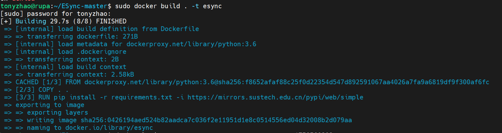
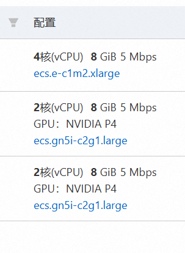
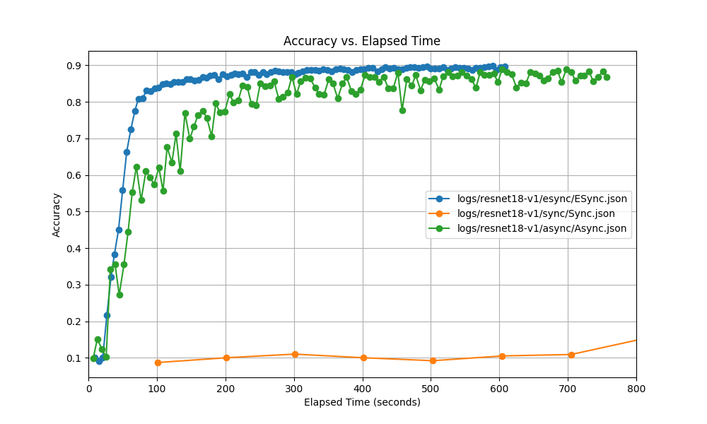
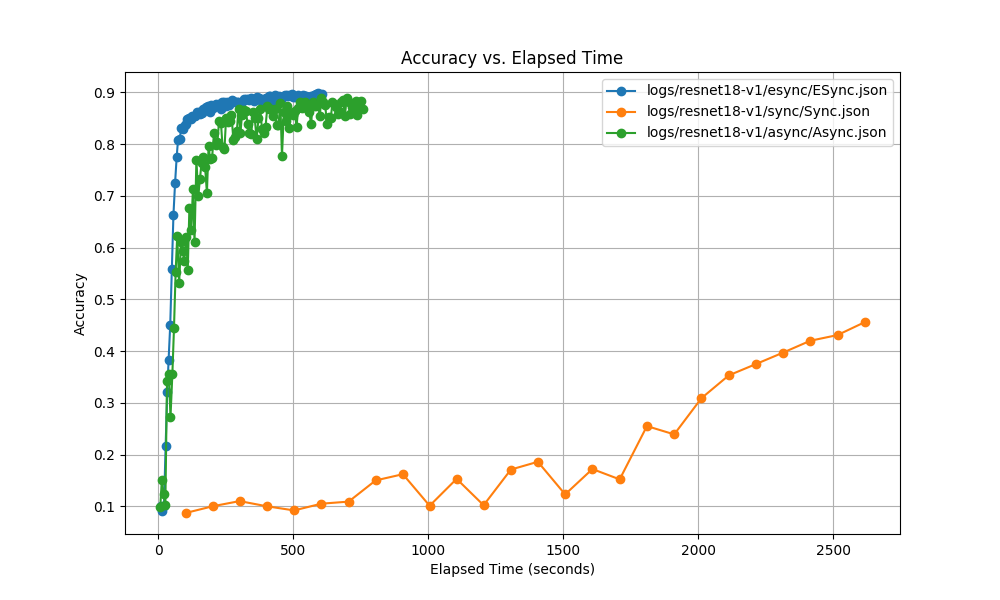

<style scoped>
section h1 {
  text-align: center;
  font-size: 80px;
  color:black;
}
section p {
  text-align: left;
  font-size: 40px;
  color: black;
  margin-top: 35px;
}
section {
  background-image: url('../assets/fm.png');
  background-size: cover;
}
footer {
  color:black;
  font-size: 20px;
}
</style>

<!-- _class: lead gaia -->

# Reproduce of ESync

**Paper:** ESync: Accelerating Intra-Domain Federated Learning in Heterogeneous Data Centers

**Team:** Li Kang(models&trainers), Zhao Tian.Y(state server&deployment), Lee Sen.J(state server&architecture)

**Date:** 31th / October / 2024

---

<style >
section{
  background-image: url('../assets/bg.png');
  background-size: cover;
  position: absolute;
}

section h2 {
  font-size: 50px;
  color: black;
  margin-top: 100px;
}

section h3{
  font-size: 40px;
  margin-top: 10px;
}

section h4{
  font-size: 35px;
  margin-top: 10px;
}

section p {
  font-size: 28px;
  color:black;
}

section table {
  text-align: center;
  font-size: 32px;
  color:black;
}

section a {
  font-size: 25px;
  color:black;
}

li {
  font-size: 27px;
  text-align: left;
}

img {
    margin-left: auto;
    margin-right:auto;
    display:block;
    margin:0 auto;
    width:25cm;
    }
</style>

<style scoped>
li {
  font-size: 38px;
  text-align: left;
}
</style>

<!-- header: Outline -->

## Outline

1. Look Back at the Paper
2. Architecture Design
3. Algorithm Implementation
4. Experimental Evaluation
5. Appreciation

---

<!--header: Look Back-->

## Background of the paper

### Scenario and Feature

- Cross-device FL & Cross-Silo FL
    - Bandwidth-limited **inter-domain** networks (cross WAN),
    - Isolated parties (scale at hundreds or thousands),
    - Uneven and non-i.i.d data distribution.
- Novel scenarios: **intra-domain FL** in heterogeneous data centers
    - Sufficient bandwidth,
    - Highly heterogeneous computing power.


---

<!--header: Idea-->

### Idea

Combining the ideas of existing either synchronous or asynchronous algorithms, the paper proposes the **ESync** algorithm.


---

<!--header: Visualization-->

### Visualization of the idea


### How to implement **ESync**?

- A novel **scheduler**.
- An efficient **synchronization algorithm** (based on SSGD).
- Analyze the **trade-off** between convergence accuracy and communication efficiency.

---

<!--header: Architecture-->

## Architecture Design

### Overview


- **State Server**: monitor the status and progress, coordinate the synchronization pace of all workers.
- **Parameter Server**: average the updates and synchronize the averaged updates to all workers.
- **Workers**: perform local updates and send their updates to the parameter server.

---

### State Server


State Server contains
- a **message receiver**, a **message sender**,
- a FIFO **message queue**,
    - buffer the received messages.
- a **message router**,
    - forward to the handlers accoring to `msg_type` field.
- a **state database**,
    - lock-free state table.
- and a set of **message handlers**.

---

### Message Format & Message Types


- **state reset message**: initiated by the Parameter Server, to initialize the records in the state database.
- **～report msg**: initiated by the worker to synchronize its status and progress to State Server.
- **～query msg**: initiated by the worker to query State Server for the next action.
- **～response msg**: used by State Server to inform the querying worker of the next action.

---

<!--header: Implementation -->

## Algorithm Implementation

### Project Overview
```
ESync-Reproduce
    |── datasets/
    |── images/
    |── logs/
    |── StateServer/
    |── models/
    |── trainer/
    |── main.py, config.py, draw.py, summary.py, utils.py
```

---

### Dataset Selection

```
ESync-Reproduce
    |── data/
        |──FashionMNIST/, CIFAR10/, ...
    |── output/
    |── logs/
    |── StateServer/
    |── models/
    |── trainer/
    |── main.py, config.py, draw.py, summary.py, utils.py
```

We chose to test the performance of the **ESync** algorithm in image classification training. So, we use the FashionMNIST, CIFAR10 ,etc. datasets for experiments.

---

### StateServer Implementation
```
    |── StateServer/
        |── __init__.py
        |── settings.py
        |── urls.py # Django URL configuration file.
        |── wsgi.py # Django Entry Point.
        |── views.py # Core Functionality.
        |── manage.py
```

In the `views.py`, we implement the core functionality of the StateServer.
- Global variables: `num_workers`, `records`, `t`, `epsilon`.
- Functions: `init_state_server(request)`, `find_stragglers()`, `apply_for_aggregation(request)`, `reset_state_server(request)`, 

---

### Models Implementation

```
    |── models/
        |── alexnet.py
        |── resnet.py
        |── ...
```

Due to the limitation of time, we conducted experiments using only `alexnet` and `resnet` from existing frameworks, adapted for training in federated learning with these frameworks.

Hyperparameters for `resnet`:
- learning rate: 0.001, local lr: 0.001, global lr: 1.0,
- batch size: 64, evaluation duration: 1,
- state server ip: 172.17.73.161, state server port: 9091.

---

### Trainer Implementation

```
    |── trainer/
        |── esync_trainer.py
        |── async_trainer.py
        |── sync_trainer.py
        |── local_trainer.py
```

Taking `esync_trainer.py` as example, it contains the implementation of a training process for a machine learning model in a distributed environment.
- Imports: `time`, `requests`, `mxnet`, `utils`.
- Variables: `local_lr`, `global_lr`, `batch_size`, etc.
- Training Loop: Batch Processing, Optimization, Global Synchronization.
- State Report, Response Handling, Evaluation(accuracy, loss, time).

---

### Distributed Training

1. Start the StateServer.
```
python3 SimpleStateServer/manage.py runserver 0.0.0.0:10010
```
The state server will listen on port 10010 in the background to wait for the queries from workers.

2. Start the Schedulers.
```
> DMLC_ROLE=scheduler DMLC_PS_ROOT_URI=172.17.73.161 DMLC_PS_ROOT_PORT=9091 DMLC_NUM_SERVER=1 \
DMLC_NUM_WORKER=4 PS_VERBOSE=1 DMLC_INTERFACE=eth0 \
python3 main.py > scheduler.log &
```
Start the scheduler and listen on port 9091 to wait for the messages from workers.

---

3. Start the Servers.
```
> DMLC_ROLE=server DMLC_PS_ROOT_URI=172.17.73.161 DMLC_PS_ROOT_PORT=9091 DMLC_NUM_SERVER=1 \
 DMLC_NUM_WORKER=4 PS_VERBOSE=1 DMLC_INTERFACE=eth0 \
 python3 main.py > server.log &
```
The parameter server will create a TCP connection to the scheduler and complete registration automatically by specifying **DMLC\_PS\_ROOT\_URI** and **DMLC\_PS\_ROOT\_PORT** (the same as workers). The aggregation operations will be performed on GPU if **cpu** is set to *False*.

4. Start the Workers.
```
> DMLC_ROLE=worker DMLC_PS_ROOT_URI=172.17.73.161 DMLC_PS_ROOT_PORT=9091 DMLC_NUM_SERVER=1 \
DMLC_NUM_WORKER=4 PS_VERBOSE=1 DMLC_INTERFACE=eth0 \
 python3 main.py -m esync -g 0 -n resnet18-v1 -ll 0.001 -b 64 -dcasgd 0 -s 0
```
---

### Dockerization

We provide a Dockerfile to build the image for the StateServer and the worker.

```
FROM python:3.6
COPY . .
RUN pip install -r requirements.txt
ENTRYPOINT ["python", "main.py",  "-dd", "./data/"]
CMD ["-m", "local", "-c", "1", "-e", "1000"]
```



---

<!--header: Evaluation-->

## Experimental Evaluation

### Experimental Setup

- **Environment Setup**: 
- **Models and Datasets**: AlexNet, ResNet, CIFAR10, FashionMNist.
- **Benchmark Algorithms**: SSGD, ASGD.
- **Training Hyperparameters**: ...

---

### Numerical Results





---
<!--header: Appreciation-->

<style scoped>
  h2 {
    text-align: center;
    margin-top: 200px;
    margin-bottom: 200px;
  }
</style>

## Thanks for your attention!

